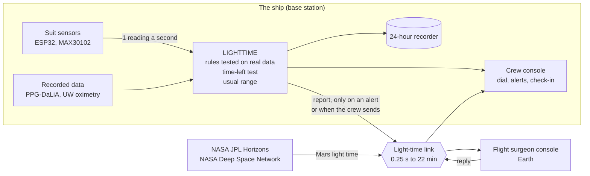

# How LIGHT-TIME fits together

```mermaid
flowchart LR
  subgraph Ship["The ship (base station)"]
    Suit["Suit sensors\nESP32, MAX30102"] -->|"1 reading a second"| ShipAI
    Replay["Recorded data\nPPG-DaLiA, UW oximetry"] --> ShipAI
    ShipAI["LIGHTTIME\nrules tested on real data\ntime-left test\nusual range"] --> Recorder[("24-hour recorder")]
    ShipAI --> Console["Crew console\ndial, alerts, check-in"]
  end
  NASA["NASA JPL Horizons\nNASA Deep Space Network"] -->|"Mars light time"| Link
  ShipAI -->|"report, only on an alert\nor when the crew sends"| Link{{"Light-time link\n0.25 s to 22 min"}}
  Link --> Earth["Flight surgeon console\nEarth"]
  Earth -->|"reply"| Link
  Link --> Console
```

Continuous on the ship, periodic to Earth: the raw stream stays in the recorder for 24 hours and never leaves.
